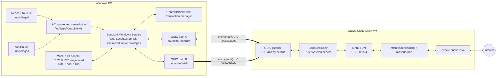

# BondLink v1 — Master Implementation Prompt

> **Status:** Draft / Proposed
> **Artifact type:** Planning specification only — no runtime implementation belongs in the planning change.
> **Promotion gate:** This specification becomes approved only after Omar reviews it and the planning change is merged.
> **Executor rule:** An implementation agent must follow this document without silently changing scope or architecture. Material changes require a new or amended ADR.

## 1. Context and goal

BondLink must become a native, one-click Windows application that combines two independent Internet paths—initially Ethernet and Wi-Fi—behind one virtual network adapter. All supported host IPv4 traffic, including TCP, UDP, ICMP, streaming, downloads, and games, must be able to traverse an encrypted tunnel to a user-owned Oracle Cloud Linux VM and leave through one Oracle public IPv4 address.

This is a **client–relay software-defined bonding gateway**, not an AI runtime and not Windows NIC teaming. No AI model is required in the data plane.

### 1.1 Verified current baseline

- `server.js:671-768` is an HTTP/HTTPS proxy that selects one local source address per new socket. It can distribute multiple proxy-aware connections, but it cannot carry all host traffic or stripe one flow across paths.
- `src/data/serverTemplates.ts:159-252` equalizes Windows route metrics and claims this forces packet distribution. Equal metrics do not establish the virtual end-to-end tunnel required by this product.
- `src/data/serverTemplates.ts:255-319` generates an x86-only OpenMPTCProuter server command and requires an OpenWrt/VM-style client, which conflicts with the confirmed native-Windows requirement.
- `src/components/BondingExplainer.tsx:43-49,116-130` conflates MPTCP, generic packet tunneling, and guaranteed game improvement. Those claims must be replaced with measured, mode-specific language.
- Before this planning branch, `README.md` was the generic AI Studio readme; the planning change replaces it with a truthful prototype/target description.
- The canonical Git repository is `https://github.com/omar-hesham/speedfy.git`; `main` contains the sanitized current-prototype baseline, and this specification belongs only on the planning branch until review.

### 1.2 External feasibility anchors

Wintun exposes a Layer-3 virtual adapter to Windows userspace and its signed DLL can be redistributed under its packaged terms, making it an appropriate capture/injection boundary for a native client.[2]

Linux MPTCP demonstrates the relevant concepts—path management, scheduling, aggregation, and failover—but its documented socket protocol is Linux-specific. BondLink therefore must not claim that a native Windows client is using Linux kernel MPTCP.[3]

OpenMPTCProuter is a proven reference for combining encrypted links through a VPS, but it is built around OpenWrt/LEDE and therefore does not satisfy the native-Windows/no-VM constraint.[4]

Oracle Always Free may provide either AMD `VM.Standard.E2.1.Micro` or Arm-based `VM.Standard.A1.Flex`. Oracle documents the AMD micro public Internet bandwidth as up to 50 Mbps, while the Ampere allocation is larger and scales with OCPUs; the relay installer must detect and report the actual shape rather than assume it.[1][5]

## 2. Product requirements

### 2.1 Confirmed user requirements

1. Native Windows application with a one-click connect/disconnect experience.
2. No OpenWrt router, WSL, Linux VM, or VirtualBox requirement on the client.
3. Two physical Internet paths used concurrently when useful.
4. Support for host IPv4 TCP, UDP, and ICMP traffic, including games.
5. One stable public IPv4 egress through the user-owned Oracle VM.
6. Graceful degradation when one path fails.
7. Explicit diagnostics that show whether both paths are carrying real traffic.
8. Safe restoration of routes, DNS, and firewall state after disconnect, crash, upgrade, or uninstall.

### 2.2 Truthful product promises

BondLink may promise:

- one virtual IPv4 interface;
- one Oracle public IPv4 egress;
- concurrent use of two paths for eligible traffic;
- failover without changing the inner virtual IP/session;
- measurable aggregation for suitable bulk traffic when the relay is not the bottleneck.

BondLink must **not** promise:

- exactly 100% of the sum of both line rates;
- lower ping than the fastest direct path;
- packet-by-packet aggregation for every application and protocol;
- improved gaming latency merely because two links are connected;
- zero packet loss during physical-link failure;
- anonymity or censorship circumvention;
- performance above the Oracle shape's actual public-network capacity.

## 3. IN scope

### 3.1 Platforms

- Client: Windows 10 22H2 x64 and Windows 11 x64.
- Relay: Ubuntu 22.04 LTS or 24.04 LTS on `x86_64` or `aarch64`.
- Two enabled IPv4 Internet interfaces in v1; the implementation must not hard-code interface names.

### 3.2 Client capabilities

- Signed Wintun DLL loaded only from the installed application directory after signature/hash verification.
- Privileged Rust Windows service for virtual adapter, routes, DNS, firewall safeguards, tunnel sessions, and recovery.
- Unprivileged React/Tauri desktop UI.
- Local CLI for diagnostics and recovery.
- Explicit per-path socket binding by interface and source IPv4 address.
- Full-tunnel IPv4 routing with host-route exceptions for each outer relay path.
- DNS routed through the tunnel while connected.
- IPv6 blocked while connected in v1 so it cannot bypass the tunnel silently.
- Three user-visible modes:
  - `balanced`: flow-aware path selection; bulk TCP may be striped after qualification.
  - `aggregate`: aggressive bulk-flow packet striping with bounded reordering.
  - `low-latency`: each flow pinned to the best healthy path; fast failover, no single-flow aggregation claim.

### 3.3 Relay capabilities

- Rust systemd service accepting authenticated QUIC connections.
- One independent QUIC connection per client path.
- Linux TUN interface for inner IPv4 packets.
- A relay-local DNS forwarding stub bound to the tunnel gateway (`10.73.0.1`) for UDP and TCP port 53; upstream resolvers are explicit relay configuration and queries leave only through Oracle egress.
- nftables forwarding and masquerade through the Oracle public interface.
- Per-device enrollment and revocation.
- Health, path, traffic, drop, reorder, and session metrics.
- Idempotent installer, doctor, upgrade, rollback, and uninstall commands.
- Multi-architecture release artifacts for Linux `x86_64` and `aarch64`.

### 3.4 Delivery capabilities

- Windows installer requiring UAC only for install/repair/uninstall and service operations.
- Start/connect at login only when the user explicitly enables it.
- Offline unit tests and deterministic network-simulation tests.
- Oracle live integration test plan that requires explicit user approval before touching the VM.

## 4. OUT of scope

- OpenWrt, WSL, Hyper-V, VirtualBox, Docker Desktop, or a client-side Linux VM.
- Native Linux, macOS, Android, or iOS clients.
- More than two active client paths.
- IPv6 tunneling or public IPv6 egress; v1 blocks IPv6 while connected instead of leaking it.
- Layer-2 bridging, broadcast, multicast discovery, or inbound port forwarding.
- Multi-tenant SaaS, subscriptions, billing, teams, web accounts, or a hosted control plane.
- Automatic creation of Oracle accounts, VCNs, security lists, or paid resources.
- Kernel MPTCP on Windows or an OpenMPTCProuter client.
- AI-based routing, model inference, or telemetry upload to an AI provider.
- Traffic inspection beyond IP headers and transport metadata required for flow classification; payloads are not logged.
- Guaranteed aggregation of a single encrypted UDP/QUIC application flow.
- Packet duplication/FEC mode in v1.
- Auto-update until signed-release rollback is implemented and tested.

## 5. Architecture

### 5.1 Component model



### 5.2 Repository target layout

```text
apps/
  desktop/                  # existing React UI, migrated and corrected
    src/
    src-tauri/
crates/
  bondlink-protocol/        # wire types, codecs, version negotiation
  bondlink-core/            # flow table, scheduler, reorder, metrics
  bondlink-wintun/          # narrow wrapper over official Wintun API
  bondlink-service/         # Windows Service + route transaction manager
  bondlink-relay/           # Linux QUIC/TUN/nftables integration
  bondlinkctl/              # local CLI and emergency recovery
schemas/
  client-config.v1.schema.json
  relay-config.v1.schema.json
  ipc.v1.schema.json
deploy/
  oracle/
    install.sh
    uninstall.sh
    bondlink-relay.service
installer/
  windows/
tests/
  network-sim/
  live-oracle/
docs/
  adr/
  operations/
Cargo.toml                  # Rust workspace
package.json                # UI scripts only
```

### 5.3 Runtime dependency policy

- Data plane: Rust; asynchronous runtime and QUIC implementation must be pinned in `Cargo.lock`.
- Proposed transport: `quinn` + `rustls` using QUIC DATAGRAM frames. Quinn exposes portable userspace QUIC, TLS 1.3 identity protection, and unreliable datagrams suitable for avoiding tunnel-level retransmission.[7]
- QUIC DATAGRAM is standardized for protected, unreliable application datagrams; it is congestion-controlled, is not retransmitted, and cannot itself be fragmented. BondLink must therefore own queue limits and MTU behavior.[6]
- Windows adapter: official signed `wintun.dll`; Rust wrapper choice remains gated by Spike S1.
- Linux TUN and nftables integration: use narrow OS adapters; shell commands are allowed only in installer/doctor code, never on untrusted values.
- No custom cryptographic primitive or home-grown handshake.
- No runtime Node.js server in the data plane.

## 6. State machines

### 6.1 Client connection state

```mermaid
stateDiagram-v2
    [*] --> Unpaired
    Unpaired --> Ready: "pair succeeds"
    Ready --> Connecting: "connect requested"
    Connecting --> Connected: "TUN + routes committed and >=1 path healthy"
    Connecting --> Ready: "setup fails; rollback succeeds"
    Connecting --> RecoveryRequired: "rollback cannot be verified"
    Connected --> Degraded: "one of two paths unhealthy"
    Degraded --> Connected: "second path recovers"
    Connected --> Disconnecting: "disconnect requested"
    Degraded --> Disconnecting: "disconnect requested"
    Connected --> Blocked: "all paths fail and kill switch is on"
    Degraded --> Blocked: "remaining path fails and kill switch is on"
    Blocked --> Connected: "a path recovers"
    Blocked --> Disconnecting: "emergency disconnect"
    Disconnecting --> Ready: "route/DNS/firewall restoration verified"
    Disconnecting --> RecoveryRequired: "restoration cannot be verified"
    RecoveryRequired --> Ready: "bondlinkctl repair-network succeeds"
```



### 6.2 Route transaction invariant

The connect transaction order is fixed:

1. Resolve the relay hostname using the pre-connect DNS configuration and freeze the selected relay IPv4 for this attempt.
2. Snapshot routes, DNS, firewall/WFP state, IPv6 policy, and adapter state into a durable recovery journal.
3. Install one relay `/32` host route per selected physical gateway.
4. Create the outer UDP socket for each path, set Windows `IP_UNICAST_IF` to the selected interface index, bind the selected source IPv4, and verify a QUIC path reaches the frozen relay IPv4.
5. Create/configure Wintun with the server-leased address and negotiated MTU.
6. Commit the IPv4 default route to Wintun.
7. Point DNS to the relay tunnel resolver and enforce physical-interface DNS plus IPv6 leak blocks.
8. Read back every invariant below, then publish `Connected`.

The service must never install the Wintun default route before verified outer relay host routes. A changed relay DNS answer starts a new guarded reconnect transaction; it may not replace a live host route in place.

The service must not advertise `Connected` until all of the following are committed and read back:

1. relay `/32` route exists through each selected physical gateway;
2. each outer socket is interface-pinned and reaches the frozen relay IPv4;
3. Wintun address and negotiated MTU are correct;
4. default IPv4 route points to Wintun;
5. configured DNS points through Wintun;
6. IPv6 and physical-interface DNS leak blocks are active;
7. at least one authenticated path is healthy;
8. the recovery journal is durable.

Every mutation has an inverse operation in the same journal. Service startup, power/hibernate resume, repair, upgrade, and uninstall must detect an unfinished transaction and either complete it or restore the pre-connect snapshot.

## 7. Configuration schemas

JSON Schema files under `schemas/` are authoritative. The examples below define exact logical fields; implementation must generate matching schemas and round-trip tests.

### 7.1 `client-config.v1.json`

```json
{
  "schemaVersion": 1,
  "deviceId": "UUID v4 — required",
  "relay": {
    "host": "DNS name or IPv4 — required",
    "port": "uint16, 1..65535 — required, default 443",
    "serverName": "TLS server name — required",
    "certificateSha256": "64 lowercase hexadecimal chars — required"
  },
  "tunnel": {
    "mode": "balanced | aggregate | low-latency — required",
    "virtualIpv4": "server-assigned IPv4/CIDR — required after pairing",
    "killSwitch": "on | off — required, default on",
    "connectAtLogin": "boolean — required, default false"
  },
  "paths": [
    {
      "pathId": "uint32 > 0 — required and unique",
      "interfaceLuid": "uint64 encoded as decimal string — required",
      "expectedSourceIpv4": "IPv4 string — required",
      "enabled": "boolean — required"
    }
  ],
  "dns": {
    "virtualResolver": "IPv4 — required, default 10.73.0.1",
    "fallbackPolicy": "block | direct-after-disconnect — required, default block"
  }
}
```

Constraints:

- Exactly two `paths` entries in v1 and at least one enabled.
- No enrollment code, private key, password, or bearer token in this file.
- Device private material is stored with Windows DPAPI under the service account and ACL-restricted to SYSTEM and Administrators.
- Writes use temp-file + flush + atomic replace; malformed files are refused, not partially applied.

### 7.2 `relay-config.v1.json`

```json
{
  "schemaVersion": 1,
  "listen": {
    "address": "IPv4 — required, default 0.0.0.0",
    "port": "uint16 — required, default 443",
    "serverName": "DNS name — required"
  },
  "tunnel": {
    "interfaceName": "Linux interface name — required, default bondlink0",
    "subnetIpv4": "IPv4 CIDR — required, default 10.73.0.0/24; must not overlap detected relay/client routes",
    "mtuMax": "uint16 — required, default 1280; negotiated session MTU may be 1000..1280",
    "egressInterface": "Linux interface name — required or auto-detected at install"
  },
  "dns": {
    "listenIpv4": "IPv4 — required, default 10.73.0.1",
    "upstreamResolvers": "array of 1..3 IPv4 addresses — required",
    "cacheEntries": "uint32 — required, default 4096"
  },
  "security": {
    "serverCertificatePath": "absolute path — required",
    "serverPrivateKeyPath": "absolute path — required",
    "clientRegistryPath": "absolute path — required",
    "allowZeroRtt": "boolean — required, must be false in v1"
  },
  "limits": {
    "maxDevices": "uint16 — required, default 4",
    "maxPathsPerDevice": "uint8 — required, fixed to 2 in v1",
    "maxQueuedDatagramsPerPath": "uint16 — required, default 1024",
    "maxReorderPacketsPerFlow": "uint16 — required, default 256",
    "maxReorderMemoryMiBPerDevice": "uint16 — required, default 64",
    "minReorderDelayMs": "uint16 — required, default 40",
    "maxReorderDelayMs": "uint16 — required, default 120"
  }
}
```

### 7.3 Runtime path metrics

```json
{
  "pathId": 1,
  "state": "probing | healthy | congested | unhealthy | disabled",
  "interfaceLuid": "123456789",
  "sourceIpv4": "192.168.1.100",
  "outerRemoteIpv4": "203.0.113.10",
  "smoothedRttMs": 35.2,
  "jitterMs": 3.1,
  "lossPercent": 0.4,
  "estimatedAvailableKbps": 42000,
  "schedulerWeight": 0.61,
  "txBytes": 123456,
  "rxBytes": 654321,
  "lastHealthyAt": "RFC3339 UTC timestamp ending Z"
}
```

## 8. Transport and protocol contract

### 8.1 Transport

- ALPN: `bondlink/1`.
- UDP destination port: configurable; default `443`.
- One QUIC connection per enabled physical path. Before handing the socket to Quinn, the service sets Windows `IP_UNICAST_IF` (or a verified equivalent) to the selected interface index, binds the selected source IPv4, and verifies the relay `/32` route through that interface.
- TLS 1.3 server authentication plus enrolled client identity.
- QUIC 0-RTT disabled in v1.
- Reliable bidirectional QUIC stream for path join, config negotiation, errors, and graceful close.
- QUIC DATAGRAM frames for inner IP packets and probes.
- The connection is refused if DATAGRAM support is absent or negotiated maximum size cannot carry the configured envelope plus MTU.

### 8.2 Path join request

```json
{
  "protocolVersion": 1,
  "deviceId": "UUID v4",
  "bondSessionId": "UUID v4 generated per connect attempt",
  "pathId": 1,
  "clientNonce": "32-byte random value, base64",
  "requestedVirtualIpv4": "null or previously leased IPv4/CIDR",
  "capabilities": ["ipv4", "quic-datagram", "mtu-1280"]
}
```

The relay returns the leased virtual IPv4, accepted MTU, server nonce, session expiry, the connecting path's public source IPv4 as observed by the relay, and a signed join result. A second path may join only the same authenticated `deviceId` and active `bondSessionId`. The reliable join binds that QUIC connection to the logical session and `pathId`; `bondSessionId` is therefore not repeated in each DATAGRAM.

### 8.3 BondLink DATAGRAM envelope

All multi-byte integers are unsigned, network byte order.

| Field | Size | Contract |
|---|---:|---|
| `version` | 1 byte | Must equal `1`; otherwise drop and count `protocol_version_drop`. |
| `kind` | 1 byte | `1=IP_DATA`, `2=PROBE`, `3=PROBE_ACK`. |
| `flags` | 2 bytes | Bit 0 `DUPLICATE`; must be zero in v1. Other bits must be zero. |
| `sequence` | 8 bytes | For `IP_DATA`, monotonic per direction and canonical inner flow key; starts at zero for that joined session. For probes, monotonic in a dedicated sequence space scoped to the joined path. |
| `sentMonotonicMicros` | 8 bytes | Sender-relative monotonic time; never interpreted as wall-clock time. |
| `payload` | variable | Remaining QUIC DATAGRAM bytes: one inner IPv4 packet for `IP_DATA`, or the probe body for probe kinds. |

The fixed BondLink header is 20 bytes. QUIC supplies the authenticated joined-path identity and exact DATAGRAM length, so neither is repeated in the envelope. Both endpoints derive the flow key by parsing the inner IPv4 5-tuple and canonicalizing the two endpoint pairs independent of direction; direction is a separate reorder/scheduler dimension. The server computes the key on the de-NATed packet read from TUN, where the client's leased virtual IP has been restored. QUIC packet protection provides replay defense per connection; the BondLink `sequence` exists for cross-path ordering and duplicate detection, not as a second cryptographic anti-replay protocol.

Malformed length, unknown flags, wrong joined path, stale sequence outside the reorder window, or non-IPv4 payload is dropped and metered. It must never reach TUN.

### 8.4 MTU and fragmentation

- Before route commit, each QUIC path reports its current maximum application DATAGRAM payload.
- Session MTU is negotiated as `min(1280, smallestHealthyPathDatagramPayload - 20)` and must be between 1000 and 1280 bytes.
- Wintun and Linux TUN use the same negotiated session MTU.
- A path whose DATAGRAM payload cannot carry the current session MTU plus the 20-byte header is excluded. If no path can carry at least 1000 bytes, `connect` refuses with `PATH_MTU_TOO_SMALL`.
- BondLink does not fragment one inner packet across multiple DATAGRAM frames in v1.
- Oversized IPv4 packets are handled through the advertised virtual-adapter MTU, TCP MSS derivation, and correct ICMP fragmentation-needed behavior; silent truncation is forbidden.
- If a live path's usable DATAGRAM size falls below the active session requirement, that path becomes unhealthy and reconnects. Lowering the session MTU requires a guarded reconnect, never an in-place silent change.
- Spike S2 must measure this behavior on reduced-MTU paths; a fixed `1280` assumption is forbidden.

### 8.5 Scheduling

1. Parse only the minimum inner IPv4 header and TCP/UDP ports needed for a canonical 5-tuple; never log payload.
2. Create a flow record on first packet and keep independent sequence/reorder state per direction.
3. `low-latency`: pin both directions of a flow to the same lowest-score path where possible; score is `RTT + 4*jitter + lossPenalty`. Move only on path failure or after a 30-second idle boundary.
4. `balanced`: pin short and UDP flows; a TCP flow becomes bulk-eligible after 1 MiB transferred and 2 seconds alive, then may stripe only while path RTT differential is at most 30 ms and loss on each path is at most 2%.
5. `aggregate`: TCP flows may stripe immediately while the same RTT/loss safety thresholds hold; otherwise the service marks `aggregate-suspended` and flow-pins until path quality recovers. UDP remains flow-pinned in v1 because arbitrary application-level QUIC/game traffic can react badly to reordering.
6. Each path has an independent bounded send queue serviced with Quinn `send_datagram_wait` or its reviewed equivalent. Scheduler weight uses delivered throughput, RTT/loss, and whether that queue currently accepts work; it does not depend on an unavailable raw congestion-window API.
7. If one path queue is full, eligible traffic is offered to another healthy path. If every eligible queue is full, drop the newest packet, increment `scheduler_backpressure_drop`, and allow the inner protocol to recover.
8. Static 50/50 is forbidden unless measured capacities and health scores are equal.
9. A path is `unhealthy` after three missed one-second probes or an explicit socket failure. QUIC idle timeout is at least 30 seconds and transport keepalive does not replace BondLink probes.
10. New packets stop using an unhealthy path immediately; the QUIC connection retries in the background.
11. No application queue may grow without a configured packet and byte bound.

### 8.6 Reordering

- Reordering is per direction and per canonical flow key, never one global queue.
- Per-flow window: maximum 256 packets.
- Delay is adaptive: `clamp(2 * abs(rttA - rttB), 40 ms, 120 ms)` and is recalculated only at safe flow boundaries; aggregate striping is suspended when quality exceeds the scheduling thresholds.
- Total reorder memory is capped at 64 MiB per device; reaching either per-flow or device cap triggers bounded gap release/drop metrics, never further allocation.
- Duplicate sequence numbers are discarded. QUIC handles cryptographic replay protection.
- When a gap exceeds either limit, release subsequent packets in order, record the missing range, and let the inner transport recover.
- UDP flows are not reordered in v1 because they are path-pinned.
- A flow idle for 120 seconds (TCP) or 30 seconds (UDP) is expired.

### 8.7 Downlink

The relay applies the same flow classification and scheduling policy to packets read from Linux TUN. It reads the de-NATed destination virtual IPv4, maps that lease to exactly one active device session, and sends only on that session's joined paths; unknown, duplicate, or unleased destinations are dropped and metered. Both directions use the same canonical flow key and prefer the same pinned path for latency-sensitive flows. The server may use different uplink/downlink weights because real connections can be asymmetric. A client path is eligible for downlink only after an authenticated path join and a recent probe/ack.

## 9. Local control interface

### 9.1 Transport and authorization

- Named pipe: `\\.\pipe\bondlink-v1`.
- Message framing: 4-byte big-endian unsigned length followed by UTF-8 JSON.
- Maximum request size: 64 KiB.
- DACL: SYSTEM, Administrators, and the installing interactive user's SID only.
- Remote pipe clients rejected.
- Service validates the connecting process token/SID before processing a request.
- UI never passes shell command strings to the service.

### 9.2 Request envelope

```json
{
  "apiVersion": 1,
  "requestId": "UUID v4",
  "operation": "status | pair | connect | disconnect | set-config | diagnose | repair-network",
  "payload": {}
}
```

### 9.3 Response envelope

```json
{
  "apiVersion": 1,
  "requestId": "same UUID as request",
  "ok": true,
  "result": {},
  "error": null
}
```

Error shape when `ok=false`:

```json
{
  "code": "STABLE_MACHINE_CODE",
  "message": "safe user-facing message",
  "retryable": false,
  "details": {}
}
```

The service must never return private keys, enrollment codes, raw packet payloads, or unrestricted filesystem paths.

## 10. CLI commands, gates, and refusal rules

### 10.1 User commands

```text
bondlinkctl status [--json]
bondlinkctl pair --relay <host:port> --server-name <name> --fingerprint <sha256> --code <one-time-code>
bondlinkctl connect --mode <balanced|aggregate|low-latency>
bondlinkctl disconnect
bondlinkctl diagnose [--json] [--duration <1..60>]
bondlinkctl set-config --kill-switch <on|off>
bondlinkctl set-config --connect-at-login <on|off>
bondlinkctl repair-network
```

### 10.2 Elevated commands

```text
bondlinkctl service install
bondlinkctl service repair
bondlinkctl service uninstall
```

### 10.3 Relay commands

```text
bondlink-relay doctor [--json]
bondlink-relay enroll --name <label> --expires-in <5m..24h>
bondlink-relay revoke --device-id <uuid>
bondlink-relay status [--json]
sudo deploy/oracle/install.sh --listen-port <1..65535> --egress-interface <name|auto>
sudo deploy/oracle/uninstall.sh --preserve-clients <yes|no>
```

### 10.4 Refusal rules

- `pair` refuses an invalid certificate hash, reused/expired code, server-name mismatch, or non-TLS relay.
- `connect` refuses an unpaired client, zero enabled paths, duplicate interface LUIDs, missing physical gateways, a relay-tunnel subnet overlap, unresolved relay, failed host-route/interface-pin verification, unsupported config version, or unresolved recovery journal.
- `connect` does not overwrite an active or connecting session; it returns `ALREADY_CONNECTED` or `CONNECT_IN_PROGRESS`.
- `set-config` validates the complete resulting config before atomic replacement. While `Connecting`, `Connected`, `Degraded`, or `Blocked`, changes are saved for the next connection and do not mutate live route/firewall state; changing mode requires disconnect/reconnect in v1.
- `disconnect` is idempotent but succeeds only after restoration is read back; otherwise returns `RECOVERY_REQUIRED`.
- `repair-network` refuses while state is `Connecting`, `Connected`, `Degraded`, `Blocked`, or `Disconnecting`; the user must disconnect first unless the service is unavailable and a stale journal proves ownership.
- `repair-network` refuses to delete routes, DNS settings, or firewall rules not recorded as BondLink-owned.
- service install refuses an existing non-BondLink service or unverified Wintun binary.
- relay install refuses unsupported OS/architecture, occupied UDP port, ambiguous egress interface, non-root execution, or existing unmanaged nftables objects with the same names.
- uninstall refuses destructive client-registry deletion unless `--preserve-clients no` is explicit.
- no command silently enables paid Oracle resources, modifies OCI tenancy objects, opens a cloud firewall, or logs credentials.

## 11. Security requirements

1. TLS 1.3 is mandatory; no plaintext or opportunistic downgrade.
2. `bondlink-relay enroll` prints the TLS certificate fingerprint and one-time enrollment code only to the authenticated SSH terminal. The user copies both out of band into `pair`; an untrusted web page is not an acceptable fingerprint channel.
3. One-time enrollment codes expire, are single-use, are stored with Argon2id (`m=65536 KiB`, `t=3`, `p=1`, random 16-byte salt) on the relay, and are limited to five failed attempts per source IP per minute.
4. Certificate rotation in v1 requires an explicit re-pair that displays old/new fingerprints; no silent pin replacement.
5. Device private key never leaves DPAPI machine-protected storage whose blob/file ACL permits only SYSTEM and Administrators.
6. The networking service runs as LocalSystem because it must manage Wintun and network state; it enables only required privileges during each operation and exposes no general command execution over IPC.
7. QUIC 0-RTT is disabled.
8. All parsers enforce maximum lengths before allocation.
9. Flow/reorder/session maps have hard entry and byte limits.
10. Protocol errors and enrollment attempts are rate-limited and do not reveal keys or internal paths.
11. Relay runs as a dedicated unprivileged user after opening only the capabilities needed for TUN/network administration; installer is root, daemon is not full root where Linux capabilities suffice.
12. nftables rules live in a dedicated `inet bondlink` table and are idempotently reconciled.
13. Windows service route/DNS/firewall changes are journaled before mutation and verified after mutation.
14. Outer relay traffic is always exempted from the virtual default route through ordered `/32` routes plus socket interface pinning.
15. Kill switch permits only narrowly scoped DHCP needed to keep the selected physical links alive and authenticated relay-path traffic. It blocks physical-interface TCP/UDP port 53, permits DNS only to the virtual resolver, and applies an outbound IPv6 block through a journaled Windows Filtering Platform or equivalently verified firewall rule.
16. IPv6 transition mechanisms are included in the leak test; implementation may not claim protection from configuration intent alone.
17. Wintun is loaded by absolute path from an administrator/SYSTEM-writable and user-read-only directory after Authenticode publisher-chain and pinned release-hash verification.
18. Logs contain metadata and counters only; no packet payloads, DNS query bodies, secrets, or full enrollment codes.
19. Release artifacts include hashes and signatures; installer verifies both before upgrade/rollback.

## 12. Oracle deployment contract

### 12.1 Detection

`bondlink-relay doctor --json` must report:

- `osId`, `osVersion`, and kernel;
- `architecture`: `x86_64` or `aarch64`;
- OCI shape when detectable, otherwise `unknown`;
- OCPU and RAM;
- public/private IPv4;
- default egress interface;
- UDP listen-port reachability status;
- forwarding and nftables state;
- measured client-to-relay throughput when a client test is requested.

### 12.2 Shape gate

- `VM.Standard.E2.1.Micro` is allowed for functional testing but must display a blocking warning before a user sets an aggregation target above Oracle's documented 50 Mbps public Internet limit.[1]
- `VM.Standard.A1.Flex` is preferred for this project, subject to regional capacity and a live throughput test; installer chooses the `aarch64` artifact automatically.[1][5]
- Unknown shapes are not rejected automatically, but performance claims remain disabled until a live client-to-relay baseline is recorded.

### 12.3 Manual cloud boundary

The installer prints the exact UDP port that must be opened in OCI. It does not use OCI credentials and does not mutate VCN/security-list rules. Any cloud-console change is a separate user-approved operation.

## 13. Diagnostics and observability

### 13.1 Required status

- virtual adapter, negotiated session MTU, and route transaction state;
- relay session and certificate identity;
- each path's interface name, source IP, public source as observed by relay, health, RTT, jitter, loss, available throughput, queue depth, bytes, and drops;
- scheduler decision counts by mode;
- reorder depth, gap releases, duplicates, and expired flows;
- current Oracle public egress IP;
- kill-switch and IPv6-block state;
- recovery-journal state.

### 13.2 Health classifications

- `healthy`: probe success and loss below configured warning threshold;
- `congested`: connected but sustained queue/RTT inflation;
- `unhealthy`: three missed probes or socket failure;
- `degraded`: exactly one of two paths healthy;
- `blocked`: no path healthy while kill switch is on;
- `recovery-required`: network restoration could not be verified.

## 14. Required disposable spikes and go/no-go gates

No full implementation begins before these spikes are completed in disposable branches/worktrees and their evidence is reviewed.

### S1 — Wintun and crash-safe routing

Build a minimal service that creates Wintun, installs relay host routes in the required order, applies interface pinning, switches IPv4 default routing, enforces DNS/IPv6 leak policy, passes packets to a loopback sink, and restores all state.

**PASS:** connect/disconnect, forced process termination, power/hibernate resume, reboot, DHCP renewal, and failed-start scenarios all restore or enter a repairable journaled state without leaving an unowned route/DNS/firewall rule; relay traffic never recurses into Wintun; DNS uses only the tunnel resolver; IPv6 and transition mechanisms cannot egress while connected. Run on Windows 10 22H2 and Windows 11.

**FAIL:** any permanent network loss, recursive tunnel route, or required manual registry cleanup.

### S2 — Two independently bound QUIC DATAGRAM paths

Open two QUIC connections to the Oracle relay, each pinned with `IP_UNICAST_IF` and bound to a selected physical source address, then send tagged DATAGRAM traffic concurrently. Exercise normal 1500-byte, reduced-MTU, asymmetric-RTT, congested, and one-path-down cases; record negotiated DATAGRAM sizes and queue/backpressure behavior.

**PASS:** relay records two distinct path IDs and the expected distinct source public addresses when the two routers truly use different upstreams; unplugging either interface leaves the other connection working; MTU negotiation chooses 1000..1280 without fragmentation; a full path queue shifts eligible work or drops within bounds.

**FAIL:** both sockets silently follow the same Windows route/interface, or DATAGRAM support/size is insufficient.

### S3 — Oracle capacity

Run single-path A, single-path B, and simultaneous client-to-relay throughput tests in both directions.

**PASS:** relay capacity is sufficient for the chosen acceptance target and does not saturate CPU or the documented shape cap first.

**FAIL:** an AMD micro 50 Mbps public limit or measured relay ceiling makes aggregation impossible for the user's line rates; resize/move the VM before implementation promises throughput.

### S4 — Scheduler and reordering simulation

Use deterministic simulated paths with independent bandwidth, RTT, jitter, loss, outage, reordering, and bounded Quinn-like backpressure. Include bidirectional canonical flow identity, de-NATed return traffic, RTT differential above the reorder ceiling, and path recovery.

**PASS:** bounded memory, no deadlock, stable bidirectional pinning, expected failover, graceful suspension of unsafe aggregation, deterministic metrics, and acceptance thresholds below.

**FAIL:** unbounded queue growth, global head-of-line blocking, cross-device/session routing, or latency-sensitive UDP striping.

### S5 — DNS and IPv6 leak boundary

With the full tunnel connected, test DNS over UDP/TCP, DHCP renewal, WebRTC/STUN observation, native IPv6, and IPv6 transition mechanisms.

**PASS:** DNS resolves through `10.73.0.1` and Oracle egress only; physical resolver packets are blocked; Oracle is the only public IPv4 observed; `curl -6` and equivalent IPv6 egress fail in v1; DHCP renewal and resume do not remove the controls.

**FAIL:** any physical DNS/IPv6 leak, or DNS becomes unusable because no relay resolver is listening.

## 15. Acceptance criteria

### 15.1 Functional

- [ ] One installer creates the app, service, CLI, and verified Wintun dependency after one UAC approval.
- [ ] A non-admin user can pair, connect, change mode, view status, and disconnect without another UAC prompt.
- [ ] While connected, IPv4 TCP, UDP, ICMP, and DNS traverse Wintun and exit through the Oracle public IPv4.
- [ ] IPv6 cannot bypass the tunnel in v1.
- [ ] Both physical paths show non-zero real payload counters during an eligible aggregate transfer.
- [ ] `low-latency` keeps UDP flows on one best path and does not claim bandwidth aggregation for them.
- [ ] Disconnect restores exact pre-connect routes, DNS, and BondLink-owned firewall changes.
- [ ] Crash/reboot recovery either restores automatically or exposes `recovery-required` and `bondlinkctl repair-network` fixes only journal-owned state.
- [ ] Relay installer supports Ubuntu on both `x86_64` and `aarch64`.

### 15.2 Performance

Let `A` and `B` be separately measured application throughput through the relay for each path, and `R` be separately measured relay capacity. Measurements use 60-second sustained transfers after a 10-second warm-up, repeated three times; report median throughput and the relay CPU/network ceiling. The aggregate target is:

```text
combined >= 0.80 * min(A + B, R)
```

Additional gates:

- [ ] In `low-latency` mode only, stable-path tunnel overhead adds no more than 15 ms to p95 RTT compared with direct client-to-relay RTT on the selected path.
- [ ] Path failure is detected within 3 seconds and new packets use a healthy path immediately after detection.
- [ ] A long-running inner TCP transfer survives one-path removal without an inner TCP RST or application-layer reconnect; throughput may dip and TCP may retransmit.
- [ ] Reorder memory never exceeds 64 MiB per device, and each flow never exceeds 256 packets or the adaptive 40..120 ms delay under 5% loss and 200 ms differential path delay.
- [ ] Idle connected mode emits at most two BondLink probes per second per path and less than 2 KiB/s total control traffic for two paths, excluding QUIC handshake/reconnect bursts.

### 15.3 Security and safety

- [ ] Invalid pins, expired enrollment codes, replayed joins, malformed datagrams, oversized lengths, and unknown flags are rejected by automated negative tests.
- [ ] 0-RTT is demonstrably disabled.
- [ ] Named-pipe access from an unauthorized local user is denied, and no IPC operation can execute an arbitrary command or path.
- [ ] Route recursion is prevented by verified transaction order, per-interface relay `/32` routes, and socket interface pinning.
- [ ] DNS UDP/TCP, DHCP renewal, native IPv6, transition IPv6, and WebRTC/STUN leak tests expose no non-Oracle public egress while connected.
- [ ] No test or production log contains private keys, enrollment codes, or packet payloads.
- [ ] Installer, upgrade, rollback, and uninstall are idempotent in clean and partially completed states.

### 15.4 Product truth

- [ ] UI and README distinguish socket distribution, full-tunnel routing, aggregation, failover, and low-latency modes.
- [ ] No `100% combined`, `lower ping`, `all games faster`, or `same as Speedify` guarantee remains.
- [ ] Oracle shape and measured relay limit are shown before throughput claims.

## 16. Test suite specification

### 16.1 Rust unit tests — offline

- `crates/bondlink-protocol/tests/envelope.rs`: exact binary round trips, endianness, malformed lengths, wrong versions, unknown flags.
- `crates/bondlink-core/tests/flow_key.rs`: stable canonical bidirectional flow identity, independent directional sequence state, and de-NATed return mapping.
- `crates/bondlink-core/tests/scheduler.rs`: weighted capacity, unhealthy exclusion, UDP pinning, mode behavior.
- `crates/bondlink-core/tests/reorder.rs`: duplicates, gaps, wrap refusal, packet/time limits, bounded memory.
- `crates/bondlink-core/tests/state_machine.rs`: every legal transition and refusal of illegal transitions.
- `crates/bondlink-service/tests/config.rs`: schema validation and atomic replacement.
- `crates/bondlink-service/tests/journal.rs`: crash points before/after every route transaction step.

### 16.2 UI tests — offline

- status and mode rendering from recorded IPC fixtures;
- explicit confirmation for kill-switch disable and repair operations;
- no success screen before service returns committed `Connected`;
- Arabic/English technical claims match the product-truth section.

### 16.3 Network simulation — offline

- two in-memory paths with configurable rate, RTT, jitter, loss, reorder, and outage;
- deterministic seeded scenarios for equal, asymmetric, congested, flapping, and dead paths;
- 30-minute bounded-memory soak in CI nightly profile;
- property tests that output packet is never duplicated unless a future negotiated duplicate flag exists.

### 16.4 Windows integration

- Wintun create/open/close;
- selected-interface socket binding;
- named-pipe ACL rejection;
- route/DNS/firewall snapshot, ordered commit, disconnect, forced crash, DHCP renewal, hibernate/resume, reboot recovery, repair, and uninstall;
- virtual-adapter MTU and no IPv6 leak.

These tests run only on a disposable Windows runner/VM or explicit local test machine. They must not alter the developer's normal network without an approval prompt and a restoration watchdog.

### 16.5 Oracle live integration

- fresh supported Ubuntu relay install;
- architecture detection;
- UDP ingress and TLS identity;
- two-path join;
- one public egress IP;
- A/B/combined throughput formula;
- UDP latency and path pinning;
- cable/Wi-Fi removal;
- upgrade rollback;
- uninstall with both preserved and explicitly deleted client registry.

The live suite requires explicit approval, the target host, and SSH access. It may not create paid resources.

## 17. Ordered implementation plan

1. Preserve the sanitized current prototype already established on canonical `main`; do not rewrite the baseline or mix runtime implementation into the planning change.
2. Land this specification, flowcharts, ADR, and an `Unreleased` changelog note in a planning-only branch/PR.
3. Run Spikes S1–S5 and record measured evidence; revise this draft if any gate fails.
4. Scaffold Rust workspace and protocol crate with failing codec/state-machine tests.
5. Implement protocol codec and shared metrics types.
6. Implement deterministic scheduler/reorder simulator using TDD.
7. Implement Linux relay TUN path against simulated client.
8. Implement Windows Wintun adapter and route transaction journal.
9. Implement dual bound QUIC paths and authenticated session join.
10. Integrate scheduler/reorder with uplink and downlink.
11. Add named-pipe API and `bondlinkctl`.
12. Migrate and correct the existing React UI into Tauri.
13. Build idempotent Oracle installer/doctor/rollback/uninstall.
14. Build signed Windows installer and emergency repair path.
15. Run offline gates, Windows integration, Oracle live suite, security review, and product-claim audit.
16. Open a separate implementation PR; do not auto-merge.

Each implementation task must follow RED → GREEN → REFACTOR, use a coherent commit, and include its exact verification result. If a spike changes architecture, stop and amend the ADR/spec before continuing.

## 18. Verification commands required from the implementation agent

Exact command names may be added during scaffold, but the implementation PR must provide and run at least:

```text
cargo fmt --all -- --check
cargo clippy --workspace --all-targets --all-features -- -D warnings
cargo test --workspace --all-features
bun run lint
bun run build
bun run test
bondlinkctl diagnose --json
bondlink-relay doctor --json
```

Release CI must build:

```text
x86_64-pc-windows-msvc
aarch64-unknown-linux-gnu
x86_64-unknown-linux-gnu
```

No agent may claim Windows routing, two-path aggregation, or Oracle deployment is verified from unit tests alone.

## 19. Git workflow

1. Canonical repository: `https://github.com/omar-hesham/speedfy.git`; use the current remote `main` baseline and fetch before implementation branching.
2. Planning branch: `plan/bondlink-v1-native-bonding`.
3. Planning PR contains only specification/ADR/roadmap/readme/changelog documentation—no runtime code.
4. Keep ADR status `Proposed` and changelog work under exactly one `Unreleased` heading until approval/merge.
5. Do not hard-code a PR number.
6. After planning approval, create implementation branch `feat/bondlink-v1-native-bonding` from the then-current `main`.
7. Use coherent `test:`, `feat:`, `fix:`, and `docs:` commits.
8. Push and open an implementation PR for review. **Do not auto-merge.**
9. Any wire-format, security-boundary, or platform-scope change requires an ADR update and reviewer approval.

## 20. Definition of done

BondLink v1 is done only when:

- all IN-scope behavior is implemented;
- all OUT-scope behavior remains absent;
- S1–S5 and all applicable automated/live gates pass with stored evidence;
- current prototype claims are corrected;
- the Windows installer and Oracle relay are exercised end to end;
- disconnect/crash/uninstall restoration is demonstrated;
- Omar reviews the result;
- the implementation PR remains unmerged until explicit approval.

A passing build, a working proxy, or a speed-test screenshot alone is not completion.

## Sources

[1] https://docs.oracle.com/en-us/iaas/Content/FreeTier/freetier_topic-Always_Free_Resources.htm — Oracle Cloud Infrastructure Always Free Resources
[2] https://www.wintun.net — Wintun — Layer 3 TUN Driver for Windows
[3] https://docs.kernel.org/networking/mptcp.html — Linux Kernel MPTCP Documentation
[4] https://github.com/Ysurac/openmptcprouter — OpenMPTCProuter Repository
[5] https://docs.oracle.com/en-us/iaas/Content/Compute/References/computeshapes.htm — Oracle Cloud Compute Shapes
[6] https://www.rfc-editor.org/rfc/rfc9221.html — RFC 9221: An Unreliable Datagram Extension to QUIC
[7] https://docs.rs/quinn/latest/quinn — Quinn Rust QUIC Documentation
